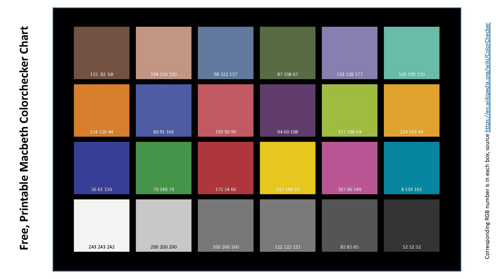
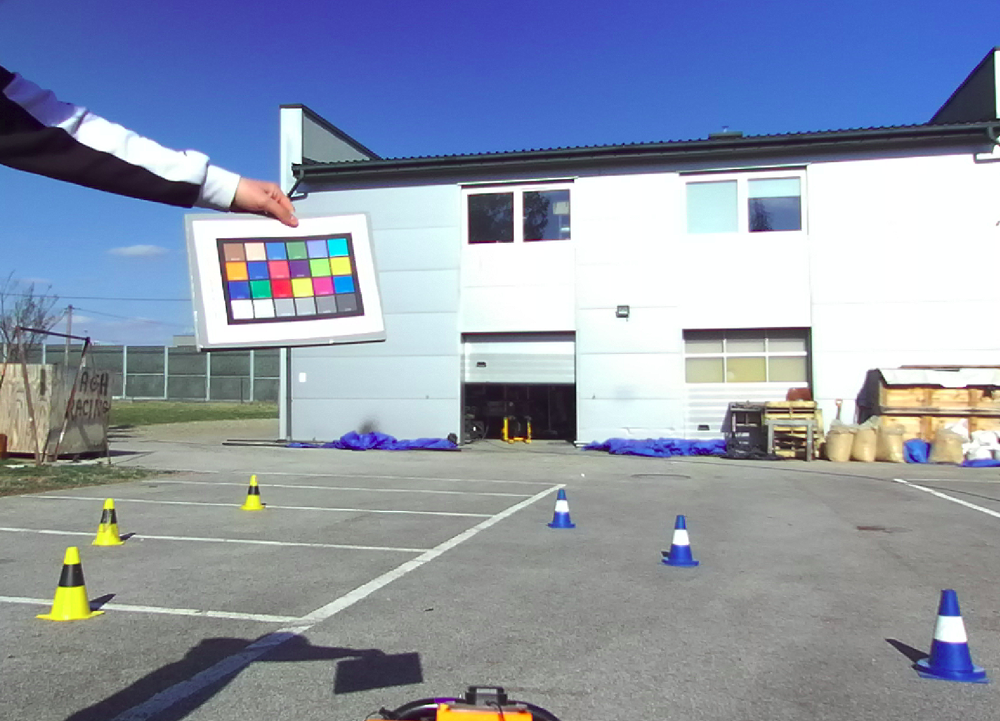
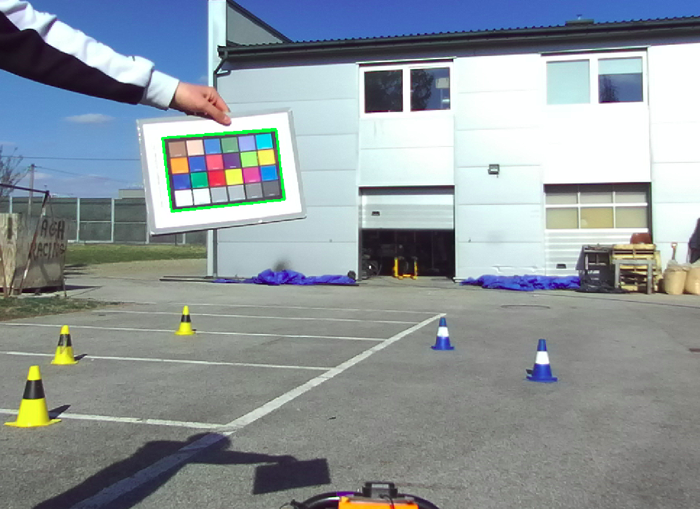
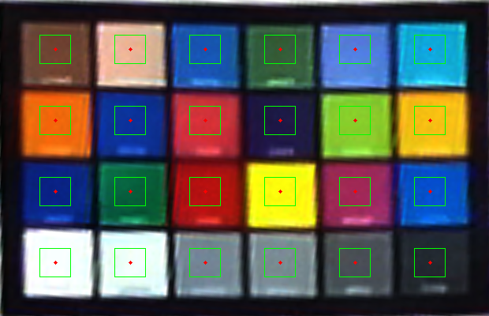
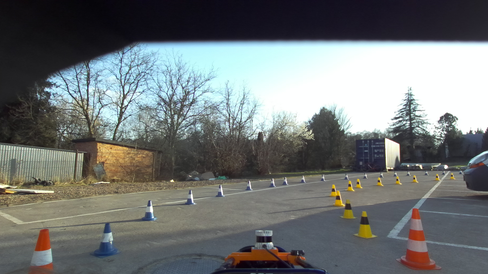
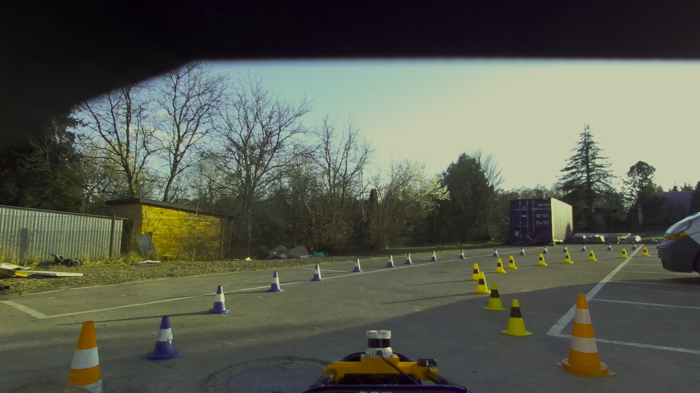

# Color calibration

ROS package for camera color calibration and correction using a 24-patch Macbeth Color Checker. It estimates a per-camera color correction matrix from live images, saves it to disk, and applies it at runtime to correct incoming camera frames.

Originally developed as an experimental part of a cone-detection pipeline, where color correction was used to standardize colors under varying conditions and improve yellow/blue/orange classification. This package contains only the calibration and correction components.

---

## Overview

1. **Calibration** — hold a color chart in front of the camera; the node detects it, samples patch colors, and writes a 3×3 correction matrix.
2. **Correction** — load the saved matrix and publish color-corrected images in real time.

```
[color_calibration_node] --> color_calibration_matrix.xml  (one-shot)

[color_correction_node]  --> corrected image topic         (continuous)
```

## Color checker used

Macbeth ColorChecker - 24 patches (4 rows x 6 columns)



---

## Pipeline overview

### Calibration

For each incoming frame:

1. Detect a rectangular color chart in the image (Canny edges -> polygon approximation -> contour filtering by aspect ratio).
2. Warp the chart to a canonical 620×400 view via perspective transform.
3. Sample mean color from each of the 24 patches.
4. Score detection confidence based on aspect ratio, chart size in frame, and perspective distortion.
5. Collect multiple samples and average the best ones.
6. Solve a linear system in gamma-linear space:
  `[R G B] × M = [R' G' B']`
   where `M` is the 3×3 correction matrix and reference patch values come from a built-in ColorChecker profile.
7. Save `M` and `calibration_gamma` to an OpenCV XML file, then shut down.

### Correction

For each incoming frame:

1. Convert BGR → RGB and normalize.
2. Apply inverse gamma (linearize).
3. Multiply by the saved correction matrix.
4. Clamp, re-apply gamma, convert back to BGR.
5. Publish the corrected image.

Gamma must match between calibration and correction (default: **2.4**).

---

## Requirements

- ROS Noetic (or compatible distro with `roscpp`, `cv_bridge`, `sensor_msgs`)
- OpenCV 4
- A camera publishing `sensor_msgs/Image` (BGR8)

Install dependencies:

```bash
sudo apt install ros-${ROS_DISTRO}-cv-bridge ros-${ROS_DISTRO}-roscpp
rosdep install --from-paths src --ignore-src -r -y
```

---

## Build

```bash
cd ~/catkin_ws/src
git clone <your-repo-url> color_calibration
cd ~/catkin_ws
catkin build color_calibration
source devel/setup.bash
```

---

## Color chart

The detector expects a **24-patch Macbeth Color Chart** laid out in a **4×6 grid** with an aspect ratio of approximately **1.55** (width : height). This matches a standard ColorChecker-style chart.

Tips for calibration:

- Chart should take roughly 15–25% of the image
- Keep it flat, fully visible, and steady
- Avoid glare and motion blur
- Calibrate in the same lighting conditions you plan to run in



---

## Usage

### Calibrate

```bash
roslaunch color_calibration color_calibration.launch
```

With a custom camera topic:

```bash
roslaunch color_calibration color_calibration.launch input_topic:=/my_camera/image_raw
```

Monitor debug output on `/color_calibration/debug` (e.g. with Foxglove). When enough good samples are collected, the matrix is saved to `config/color_calibration_matrix.xml` and the node exits.





### Apply correction

```bash
roslaunch color_calibration color_correction.launch
```

View output on `/color_correction/corrected_image`, or remap topics as needed:

```bash
roslaunch color_calibration color_correction.launch \
  input_topic:=/my_camera/image_raw \
  output_topic:=/my_camera/image_corrected
```

<table>
  <tr>
    <td align="center"><b>Raw</b></td>
    <td align="center"><b>Corrected</b></td>
  </tr>
  <tr>
    <td></td>
    <td></td>
  </tr>
</table>

> **Note:** Corrected output appears worse than the original — the initial goal was to standardize colors across different conditions. The yellowish tone is likely a result of a several factors - mainly due to the fact that the Color Checker we used was printed by us on a not-so-high-quality printer and that the gamma parameter was chosen by trial and error, since it wasn't provided in the specification of our camera.

---

## Configuration

Both launch files load `config/color_calibration.yaml`. Launch arguments override topic names and `gamma` after the YAML is loaded.

| Parameter | Default | Used by | Description |
|-----------|---------|---------|-------------|
| `gamma` | `2.4` | both | Gamma for linearization; must match between calibrate and correct |
| `calibration_matrix_rows` | `3` | calibration | `3` = 3×3 matrix, `4` = 3×4 with bias term |
| `total_samples` | `20` | calibration | Chart detections to collect before solving |
| `k_best` | `15` | calibration | Best detections kept for averaging |
| `confidence_threshold` | `0.8` | calibration | Minimum chart detection confidence |
| `visualize_patches` | `false` | calibration | Show warped chart with patch ROIs (debug only; skips matrix computation when `true`) |
| `visualize_chart` | `false` | calibration | Show detected chart outline on raw image |

The matrix output path is set in the launch files as `$(find color_calibration)/config/color_calibration_matrix.xml`.

---

## Launch arguments

| Argument | Default | Description |
|----------|---------|-------------|
| `input_topic` | `/zed2i/zed_node/rgb/image_rect_color` | Camera image topic |
| `output_topic` | `/color_calibration/debug` or `/color_correction/corrected_image` | Output image topic |
| `color_gamma` | `2.4` | Overrides `gamma` from YAML; must match between calibrate and correct |

The matrix file path is set in the launch files as `$(find color_calibration)/config/color_calibration_matrix.xml`.

---

## Nodes

### color_calibration_node

One-shot calibration. Subscribes to `input_topic`, publishes debug images on `output_topic`, writes the matrix to `color_calibration_matrix_path`. Reads calibration-specific settings from `config/color_calibration.yaml`.

### color_correction_node

Continuous correction. Subscribes to `input_topic`, publishes corrected images on `output_topic`, reads the matrix from `color_calibration_matrix_path`. Uses `gamma` from the same YAML file.

---

## Output file

The calibration node writes an OpenCV XML file:

```xml
<opencv_storage>
  <color_calibration_matrix type_id="opencv-matrix">
    <rows>3</rows>
    <cols>3</cols>
    ...
  </color_calibration_matrix>
  <calibration_gamma>2.4</calibration_gamma>
</opencv_storage>
```

The matrix is camera- and lighting-specific. Re-calibrate when changing cameras or operating in significantly different lighting.

---

## Troubleshooting

| Symptom | Fix |
|---------|-----|
| `No board candidate found` | Move chart closer/further, improve lighting, make sure there is enough of a contrast between edges of the checkerboard and background |
| Node never saves matrix | Hold chart steady longer; check debug topic; ensure debug visualizations flags are set to false in YAML |
| `Gamma mismatch` | Use the same `color_gamma` in both launch files, or re-calibrate |
| No correction output | Check that the matrix file exists and path is correct |